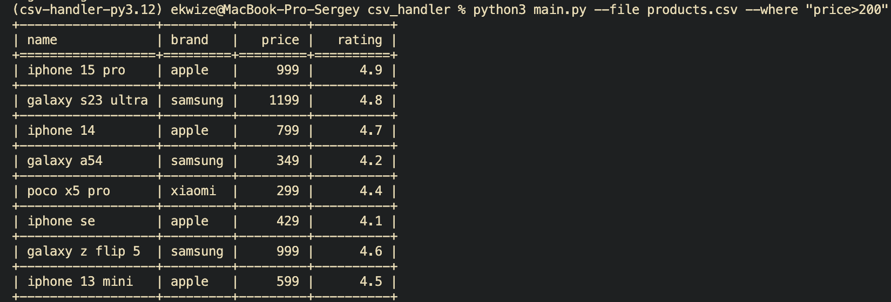

# CSV Data Processor

Минимальный обработчик CSV с фильтрацией и агрегацией данных

## Установка и запуск

```bash
poetry init
poetry install
poetry shell
python main.py --file products.csv --where "some conditions" --agg "some conditions"
```

## Запуск тестов

```bash
pytest -v
```

## Пример работы

### Фильтрация



### Фильтрация с агрегацией

